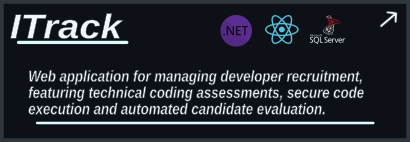
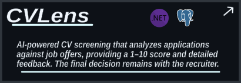

## 👨‍💻 About Me

I'm a 5th-year Computer Science student specializing in Cybersecurity, with a focus on backend and full-stack development using the .NET ecosystem.

## 🚀 Projects

&nbsp;&nbsp;&nbsp;&nbsp;

## 💻 Tech Stack

### ⚙️ Backend

      

### 🎨 Frontend

     

### 🗄️ Databases

  

### 🔐 Authentication & APIs

  

### 🧪 Testing

 

### ☁️ Cloud & DevOps

  

### 🛠️ Tools

  
