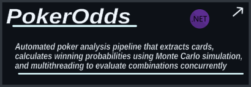
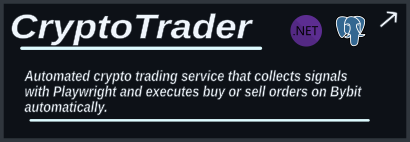
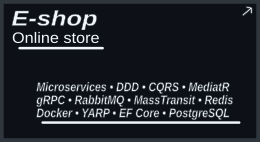
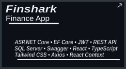
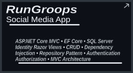
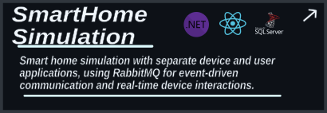
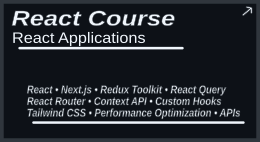

## 👨‍💻 About Me

I'm a 5th-year Computer Science student specializing in Cybersecurity, focused on backend and full-stack development with the .NET ecosystem and React.

## 🚀 Projects

&nbsp;&nbsp;&nbsp;&nbsp;

&nbsp;&nbsp;&nbsp;&nbsp;

## 📖 Learning projects

&nbsp;&nbsp;

&nbsp;&nbsp;

## Currently working at

&nbsp;&nbsp;&nbsp;&nbsp;

## 💻 Tech Stack

### ⚙️ Backend

### 🎨 Frontend

### 🗄️ Databases

### 🔐 Authentication & APIs

### 🧪 Testing

### ☁️ Cloud & DevOps

### 🛠️ Tools

